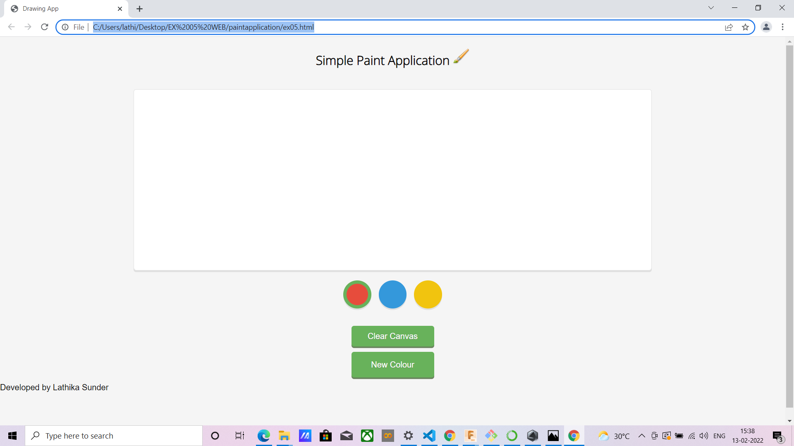

# Web Page for Paint Application

## AIM:

To design a static website for Paint Application using HTML5 canvas.

## DESIGN STEPS:

### Step 1:

Requirement collection.

### Step 2:

Creating the layout using HTML,CSS and canvas.

### Step 3:

Write javascript to capture move events.

### Step 4:

Perform the drawing operation based on the user input.

### Step 5:

Validate the layout in various browsers.

### Step 6:

Validate the HTML code.

### Step 6:

Publish the website in the given URL.

## PROGRAM :

--include your code--

Web Page for Paint Application
AIM:
To design a static website for Paint Application using HTML5 canvas.

DESIGN STEPS:
Step 1:
Requirement collection.

Step 2:
Creating the layout using HTML,CSS and canvas.

Step 3:
Write javascript to capture move events.

Step 4:
Perform the drawing operation based on the user input.

Step 5:
Validate the layout in various browsers.

Step 6:
Validate the HTML code.

Step 6:
Publish the website in the given URL.

PROGRAM :
'''
<html>
  
  <!--
    Based off Team Treehouse jQuery Project
  -->
  
<head>
<meta charset="utf-8">
<title>Drawing App</title>
<link rel="stylesheet" href="ex05.css" type="text/css" media="screen" title="no title">
<link href='https://fonts.googleapis.com/css?family=Open+Sans:300' rel='stylesheet' type='text/css'>
</head>
<body>
  <h2>Simple Paint Application </h2>
<canvas	width="1000" height="350" id="mainCanvas"></canvas>

	<ul>
		<li class="red selected"></li>
		<li class="blue"></li>
		<li class="yellow"></li>
	</ul>
	<button id="clear" onclick='clear_canvas_width ()'>Clear Canvas</button>
	<button id="revealColorSelect">New Colour</button>
	

		
		

			

				<label for="red">Red</label>
				<input id="red" name="red" type="range" min=0 max=255 value=0>
			

			

				<label for="green">Green</label>
				<input id="green" name="green" type="range" min=0 max=255 value=0>
			

			

				<label for="blue">Blue</label>
				<input id="blue" name="blue" type="range" min=0 max=255 value=0>
			

		

		

			<button id="addNewColor">Add Colour</button>
		

	

</body>
</html>'''

## OUTPUT:

-- include your output screenshots ---

## Result:

Thus a website is designed and validated for paint application using HTML5 canvas.
